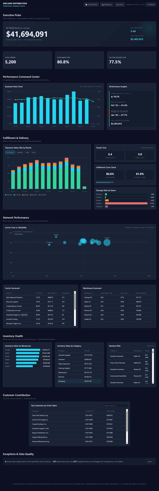
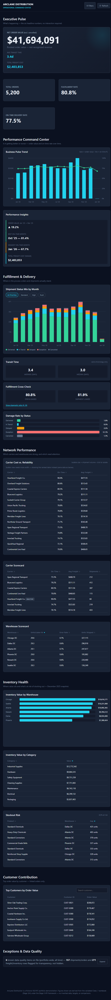

# ArcLane Distribution — Operational Command Center

**Live demo:** https://arclanedistribution.netlify.app/

## Project Status

Fictional portfolio project, built to demonstrate a data audit, cleaning, and dashboard workflow for a distribution/logistics business. Not a real client project.

## Screenshots

<!--  -->
<!--  -->

## Overview

ArcLane turns operational data (orders, shipments, freight, inventory, warehouses, carriers) into a single dashboard for tracking fulfillment, delivery performance, and carrier reliability. Most of the effort went into getting the underlying data right before building anything on top of it.

## Data Audit & Cleaning

Started from nine raw datasets, roughly 18,500 rows combined, with real problems: duplicate rows, mixed date formats, numbers stored as text, inconsistent naming across sheets, and a genuine mismatch between recorded region and state. Each issue was reviewed individually. Straightforward fixes were applied automatically. Anything needing a judgment call — like whether "region" meant a sales territory or a geographic state — was flagged instead of guessed at. Cleaned data was validated against the raw source before any dashboard work started.

## Key Features

- Live data from nine Google Sheets tabs, fetched client-side via Google's public gviz endpoint. No backend, no API key.
- Cross-sheet checks that throw a specific error, naming the row and sheet, if a shipment references a warehouse, carrier, or product missing from the reference data. No silent guessing.
- Seven sections via jump navigation: Pulse, Trends, Fulfillment, Network, Inventory, Customers, Exceptions.
- Carrier cost-vs-reliability quadrant chart, plotting on-time rate against average freight cost.
- Below roughly 760px width, the quadrant switches to a ranked table with the same data instead of getting squeezed illegibly.
- Refresh button that re-fetches all nine tabs, with loading and success states.
- Date, warehouse, and carrier filters, with a separate mobile filter sheet.
- Row-count and column-mapping diagnostics logged on load, so a schema change in the source sheet doesn't fail silently.

## KPI Approach

KPIs were evaluated one at a time rather than charting everything the data could technically produce. Some were rejected as unreliable, one was deferred for lack of a clear definition. What made it onto the dashboard is grouped by tier: headline metrics, operational metrics, diagnostics, and data-quality/exception indicators.

## Technology

Vanilla JavaScript, HTML, and CSS. No frameworks, no build step, no chart library. Charts are inline SVG/DOM elements rendered directly from the fetched data.

## Architecture

Two scripts. One handles rendering, filtering, and KPI calculations. The other fetches and parses the nine sheet tabs, maps columns, coerces types, and checks relationships between sheets before passing data to the first script. Filtering recomputes everything client-side, so there's no re-fetch on every interaction.

## Project Structure

```
arclane-distribution/
├── index.html      — markup and layout shell
├── style.css       — styling, responsive breakpoints, design tokens
├── app.js          — dashboard logic, data loading, cross-sheet validation, filtering
└── README.md
```

## VELYNT Context

Built to demonstrate the kind of data-to-dashboard work done under VELYNT, a dashboard studio that turns messy operational data into decision-ready dashboards.
